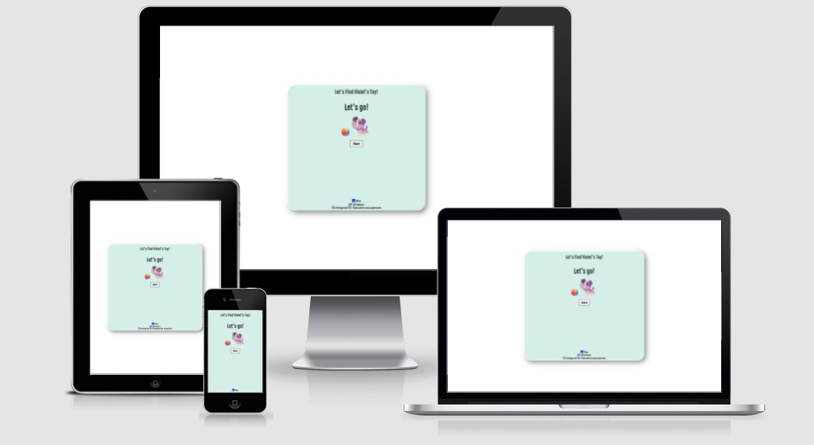
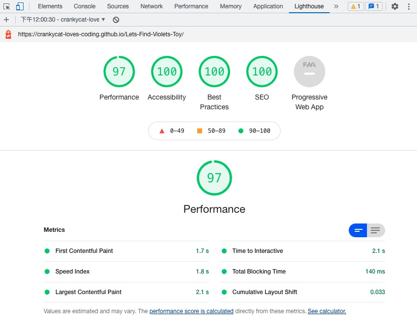
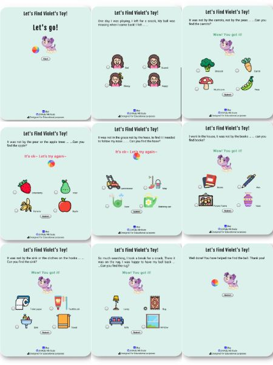

# [**Let’s find Voilet’s Toy Game**](https://crankycat-loves-coding.github.io/Lets-Find-Violets-Toy/)

## **Overview**

I create this game for my 3-year-old toddler. This idea came from one of her favorite books <Let’s find Violet’s Toy>. This book was published by the LeapFrog company. It's a story about how the dog Violet eventually found its toy.I created this game as part of my coding project.

## **Table of Contents**

- [**Let’s find Voilet’s Toy**](#overview)
  - [**Overview**](#overview)
  - [**Table of Contents**](#table-of-contents)
    - [**1. What Is It?**](#1-what-is-it)
    - [**2. How to Achieve?**](#2-how-to-achieve)
    - [**3. Testing and Launch**](#3-testing-and-launch)
    - [**4. Deployment**](#4-deployment)
    - [**5. Support**](#5-support)
    - [**6. Reference and Research**](#6-reference-and-research)

### **1. What Is It?**

- The Goal of The Game

  - This game is based on the book <Let’s find Violet’s Toy> published by the LeapFrog company. This is a narrative storybook. It helps children learn how stories are put together. As children begin to see that storybooks include characters, settings, and a sequence of events with a clear beginning, middle and end, they can better comprehend new stories.
  - The book introduces children to words and feelings through activities.
  - This game is designed to be easy, attractive and fun for children to play.
  - This game is also perfect for family time.

- Target Audience

  - 3-years-old toddler
  - Parents who want to teach their children literacy skills

[Back to the top](#overview)

### **2. How to Achieve?**

- Features

  - **Header**

    Featured at the top of the page, the header shows the game name :Let’s Find Violet's toy!
    

  - **How to Play**

    Violet is a bright purple puppy with a pink collar and white markings. There are eight scenes.A welcome page contains a start button allowing players to start the game.A ball will appear if the player has a wrong answer and a message of 'It's ok~ Let's try again~' will display.If the player gets the correct answer, Violet will appear with a message of 'Wow! You got it!'.The message of 'Well done! You have helped me find the ball. Thank you!'will appear when the player completes the quiz and a restart button will show.
    Players will learn the words **'Sad, Carrot, Apple, Hose, Books, Sink** and **Rug'** by completing this quiz.

- Style Elements
  - **Fonts**
  
    *Roboto* has a dual nature. It has a mechanical skeleton and the forms are largely geometric. At the same time, the font features friendly and open curves. While some grotesks distort their letterforms to force a rigid rhythm, Roboto doesn’t compromise, allowing letters to be settled into their natural width. This makes for a more natural reading rhythm more commonly found in humanist and serif types.

    *Fjalla One* is a medium contrast display sans serif. Fjalla One has been carefully adjusted to the restrictions of the screen. Despite having display characteristics Fjalla One can be used in a wide range of sizes.

  - **Icons**

    Icons from Font Awesome used to style social links to create a tidy and easy access for subscription.
    Icons from Flaticon used to display answers.This helps players to recorgnize words.

- Footer
  - Icon links to purchase the produce and credit resourse provider and to GitHub.

- Technology Stack

  - HTML5
  - CSS3
  - Gitpod/Github
  - [W3C HTML Validation Service](https://validator.w3.org/#validate_by_input)
  - [W3C CSS Validation Service](https://jigsaw.w3.org/css-validator/#validate_by_input)
  - [Font Awesome](https://fontawesome.com/)
  - [Google Fonts](https://fonts.google.com/)
  - [flaticon](https://www.flaticon.com/)
  - [fandom](https://leapfrog.fandom.com/wiki/Violet)

[Back to the top](#overview)

### 3. **Testing and Launch**

- HTML validation

  - No errors or warnings were found when passing through the official W3C validator.

- CSS validation

  - No errors or warnings were found when passing through the official Jigsaw validator.

- Accessibility

  - The colors and fonts chosen are easy to read and accessaiible by running it through lighthouse in devtools.

- Testing on devices browsers
  - There was no issue found when tested on iPhone7 device
  
  - There was no issue found when tested the game in different browsers: Chrome, Firefox, Safari

[Back to the top](#overview)

### 4. **Deployment**

- The game was deployed to GitHub page. The steps to deploy are as follows:
  - In the GitHub repository, navigate to the Setting tab
  - Select Page on the bottom left
  - From the source section drop-down menu, select the  main branch and save
  - Once the main branch has been selected, the page provided the link to the completed website.

The live link can be found here [link](https://crankycat-loves-coding.github.io/Lets-Find-Violets-Toy/)

[Back to the top](#overview)

### 5. **Support**

- Mentor

  - [Simen Daehlin](https://www.linkedin.com/in/simendaehlin/)
  A lead Full Stack Developer & Mentor

  [Back to the top](#overview)

### 6. **Reference and Research**

- Reference

  - [Build A Quiz App With JavaScript](https://www.youtube.com/watch?v=riDzcEQbX6k&list=PLKNe8p6OAKBwrz14Cgw31I6DVLo8_KP_z&index=15&ab_channel=WebDevSimplified)
  - [Create a Quiz App using HTML CSS & JavaScript](https://www.youtube.com/watch?v=CqddbIrEM5I&ab_channel=CodingWithNick)

[Back to the top](#overview)
